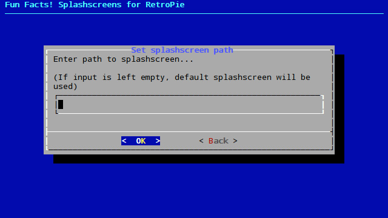
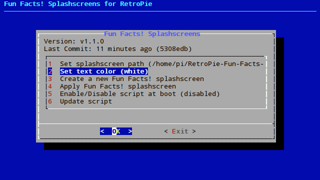
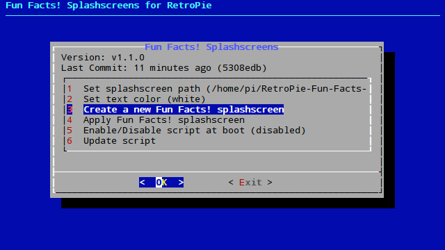

# Fun Facts Splashscreens for RetroPie

> Not working yet! Well, it's working, but it's not officially released! It's just for testing purposes!

This script generates splashscreens for RetroPie with a random **Fun Fact!™**.

**WARNING: Splashscreens are only only available on the Raspberry Pi.**

For now, this is the best way to use the splashscreen created by this script:

* Create a **Fun Fact!™** splashscreen. See the [examples below](#examples).
* Go to the **Splashscreen Menu** (the Splashscreen Menu can be accessed from the RetroPie Menu in EmulationStation or from the setup script under option 3)
* Select the `Choose Own Splashscreen` option. See the [Splashscreen wiki](https://github.com/retropie/retropie-setup/wiki/splashscreen).
* Select the recently created **Fun Fact!™** splashscreen.

## Instalation

```
cd /home/pi/
git clone https://github.com/hiulit/es-fun-facts-splashscreens.git
cd es-fun-facts-splashscreens/
sudo chmod +x es-fun-facts-splashscreens.sh
```

## Usage

```
sudo ./es-fun-facts-splashscreens.sh [options]
```

If no options are passed, you will be prompted with a usage example:

```
USAGE: sudo ./es-fun-facts-splashscreens.sh [options]

Use '--help' to see all the options
```

## Options

* `--help`: Print the help message and exit.
* `--splash [options]`: Set which splashscreen to use.
* `--text-color [options]`: Set which text color to use.
* `--create-fun-fact`: Create Fun Fact Splashscreen.
* `--enable-boot`: Enable script to be launch at boot.
* `--disable-boot`: Disable script to be launch at boot.
* `--gui`: Start GUI.

If `--splash` or `--text-color` are not set, the script takes the splashscreen and the text color defaults, `retropie-default.png` and `white`, respectively.

## Examples

### `--help`

Print the help message and exit.

#### Example

```
sudo ./es-fun-facts-splashscreens.sh --help
```

### `--splash [options]`

Set which splashscreen to use.

#### Options

* `path/to/splashscreen`: Path to the splashscreen to be used.

#### Example

```
sudo ./es-fun-facts-splashscreens.sh --splash /home/pi/Downloads/retropie-2014.png
```

### `--text-color [options]`

Set which text color to use.

#### Options

* `color`: Text color to be used.

#### Example

```
sudo ./es-fun-facts-splashscreens.sh --text-color black
```

### `--create-fun-fact`

Create Fun Fact Splashscreen.

#### Example

```
sudo ./es-fun-facts-splashscreens.sh --create-fun-fact
```

### `--enable-boot`

Enable script to be launch at boot.

**Backing up `/etc/rc.local` is most recommended before using this option. It could erase important stuff. Use it at your own risk.**

#### Example

```
sudo ./es-fun-facts-splashscreens.sh --enable-boot
```

### `--disable-boot`

Disable script to be launch at boot.

**Backing up `/etc/rc.local` is most recommended before using this option. It could erase important stuff. Use it at your own risk.**

#### Example

```
sudo ./es-fun-facts-splashscreens.sh --disable-boot
```

### `--gui`

Start GUI.

It let's you perform all the previous functions, but in a more friendly manner.

#### Example

```
sudo ./es-fun-facts-splashscreens.sh --gui
```

##### Set splashscreen (`--splash`)

##### Enter path to splashscreen

##### Set text color (`--text-color`)

##### Choose a color

##### Create a new Fun Fact! splashscreen (`--create-fun-fact`)

##### Enable at boot (`--enable-boot`)

##### Disable at boot (`--disable-boot`)


## Config file

When setting the splashscreen path using `--splash` or setting the text color using `--text-color`, whether it's done via the command line or the GUI, the generated values are stored in `fun_facts_settings.cfg`.

```
# Settings for Fun Facts!

# Must be an absolute path.
# (e.g /home/pi/my-awesome-splashscreen.png)

splashscreen_path = ""

# Short list of available colors:
# -------------------------------
# black, white, gray, gray10, gray25, gray50, gray75, gray90,
# pink, red, orange, yellow, green, silver, blue, cyan, purple, brown.
#
# TIP: run the 'convert -list color' command to get a full list.

text_color = ""
```

You can edit this file directly instead of using `--splash` or `--text-color`.

## Changelog

See [CHANGELOG](/CHANGELOG.md).

## Contributing

See [CONTRIBUTING](/CONTRIBUTING.md).

## Authors

Me 😛 [@hiulit](https://github.com/hiulit).

## Credits

Thanks to:

* [Parviglumis](https://retropie.org.uk/forum/user/parviglumis) - For the idea of creating the [Fun Facts Splashscreens](https://retropie.org.uk/forum/topic/13630).
* [meleu](https://github.com/meleu/) - For all his help and wisdom with the code and for all the PRs! :D
* All the people at the [RetroPie Forum](https://retropie.org.uk/forum/).

## License

[MIT License](/LICENSE).
